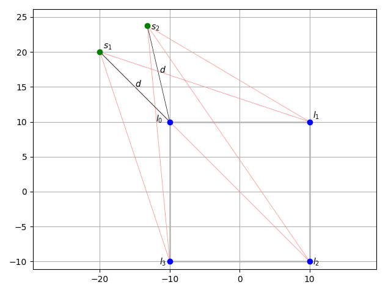

# DBAP 

Author: Jacob Sundstrom

__This is pre-alpha and should NOT be deployed in the field!__ It is in a highly experimental stage.

Distance-based ampltide panning (DBAP). Based on the [paper](https://pdfs.semanticscholar.org/132a/028b9febadd03f2c75e5f79ca500c2dd04fd.pdf?_ga=2.103137216.1512247688.1571200723-789701753.1569525663) by Trond Lossius, Pascal Baltazar, and Théo de la Hogue with some significant changed described below.

### Changes

This version differs from the version of DBAP put forward by Lossius et al. primarily in the way the gains are calculated for sources outside the "convex hull". In Lossius 2.6, the issue of sources outside the field of speakers is presented. As a source moves further and further away, the difference between the gains for each speaker is reduced, thus causing the source to lose its perceived spatial properties. To counteract this, Lossius suggests _projecting_ the source that is outside the field onto the _convex hull_ of the loudspeaker field and to use this projected point in subsequent calculations of gain. Doing so would likewise give the distance from the source to the speaker field and thus allow the amplitudes to be scaled as a function of the distance from the hull. The projection provides sufficient biasing of the gains to maintain the spatial illusion.

In cases where the projection is orthogonal to the perimeter of the convex hull, this works adequately. However, when a projection is _not_ orthogonal, as in the case of the area beyond the vertices of the convex hull where the projection is one of the vertices, this method fails to provide a unique solution. In particular, all spatial differentiation is lost when different sources share the same projection onto one of the vertices. This is the case for all points in the shaded areas below.

#### Example
Take the example above of a set of speakers where the convex hull is a square with vertices $l_{0}$, $l_{1}$, $l_{2}$, and $l_{3}$ at _(-10,10), (10,10), (10,-10)_, and _(-10,-10)_, respectively. Given a source, $s_{0}$, at _(-20,1)_, the nearest point on the convex hull is _(-10,1)_ on the segment $\overleftrightarrow{l_{0}l_{3}}$. The segments used for gain calculation are plotted in red. Note further that this projection is orthogonal to the segment and thus provides no problems using the method suggested by Lossius.

Consider now two sources, $s_{1}$ at _(-20,20)_ and $s_{2}$ at _(-13.21, 23.77)_. The projection onto the convex hull for both of these points is $l_{0}$, _(-10,10)_, and these projections are _not_ orthogonal. Note further that both of these sources are also equidistant from $l_{0}$ with distance $d = 14.14$. Using the method suggested by Lossius, these sources both collapse onto $l_{0}$ and the calculated amplitudes are scaled equally since their distances are identical. The resulting gain calculations then produce the same result and the sources become spatially equivalent though it is clear that, for instance, $d(\overleftrightarrow{s_{1}l_{i}}) \neq d(\overleftrightarrow{s_{2}l_{i}})$ for every $i$ except _0_. In the inverse, a given set of gain calculations for a source outside the convex hull does not necessarily yield a unique point and depends only on the distance from the vertex. This problem is exacerbated when the inner angle of the convex hull narrows about a vertex.

This finding further explains the findings of Eckel et al. in their paper "A framework for the choreography of sound" when they write of DBAP: "[W]e discovered that especially the trajectory of moving sounds (as in the example described in section 4.3.2) appears more clearly shaped or ”sharper” [in ADBAP], compared to the unmodified DBAP algorithm." If the implementation was as Lossius suggests, it is no surprise that there was poor spatial differentiation for sources outside the hull.

#### One Solution

To compensate for this, several changes are made. In the first place, both the distances between the real source position and speakers ($d_{ir}$), as well as the distances from the projection onto the convex hull and the speakers is calculated ($d_{ip}$):

<!-- $$
d_{ir} = \sqrt{(x_{ir} - x_{s})^2 + (y_{ir} - y_{s})^2 + r_{s}^2}
$$ -->

<d1>
 

 
 
</d1>

where $x_{ir}$ is the $x$ position of the source's real position, and $y_{ir}$ is the $y$ position of the source's real position. And:

<!-- $$
d_{ip} = \sqrt{(x_{ip} - x_{s})^2 + (y_{ip} - y_{s})^2 + r_{s}^2}
$$ -->
<d1>
 

 
 
</d1>

where $x_{ip}$ is the $x$ position of the source's projected position, and $y_{ip}$ is the $y$ position of the source's projected position. The hack occurs when the projected distance becomes less than 1; at this point, the term $k$ in Lossius skyrockets and causes the entire system to collapse. Instead, 1 is added to $d_{ip}$ such that the minimum is 1 to stabilize the algorithm. This causes some spatial distortion but in practice it has not proved terribly problematic and is doubtless better than the alternative of allowing the $k$ term to grow very high.

Another term is then introduced to express the ratio between the real distance and the projected distance, $d_{ic}$. For a source inside the convex hull, it is equal to the real distance, $d_{ir}$. If the source is outside the convex hull, it is defined as the square root of the product of the real and projected distances:

<!-- $$
d_{ic} = \sqrt{d_{ir} d_{ip}}
$$ -->
<d1>

 
 
</d1>

From there, $d_{ic}$ is substituted for $d_{i}$ in Equation 9 to calculate the gains for each speaker:

<!-- $$
v_{i} = \frac{kw_{i}}{d_{ic}^a}
$$ -->
<d1>

 
 
</d1>

### Requirements

- CMake >= 3.5
- SuperCollider source code
- Boost Geometry >= 1.65.1.0

### Building

#### Installing Boost

DBAP uses Boost geometry to make some of the calculations easier to deal with. It may be removed in future versions.

Ubuntu/Debian:

    sudo apt-get install libboost-dev

macOS with Homebrew:

    brew install boost

#### Compiling

Clone the project:

    git clone https://woolgathering/dbap
    cd dbap
    mkdir build
    cd build

Then, use CMake to configure and build it:

    cmake .. -DCMAKE_BUILD_TYPE=Release
    cmake --build . --config Release
    cmake --build . --config Release --target install

You may want to manually specify the install location in the first step to point it at your
SuperCollider extensions directory: add the option `-DCMAKE_INSTALL_PREFIX=/path/to/extensions`.

It's expected that the SuperCollider repo is cloned at `../supercollider` relative to this repo. If
it's not: add the option `-DSC_PATH=/path/to/sc/source`.

### Developing

Use the command in `regenerate` to update CMakeLists.txt when you add or remove files from the
project. You don't need to run it if you only change the contents of existing files. You may need to
edit the command if you add, remove, or rename plugins, to match the new plugin paths. Run the
script with `--help` to see all available options.
